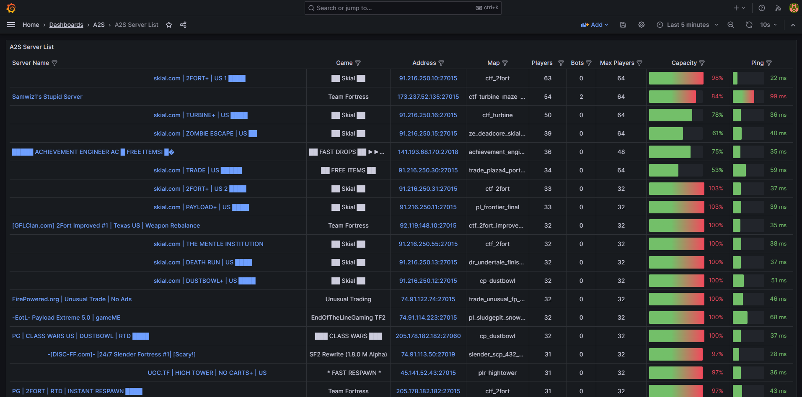
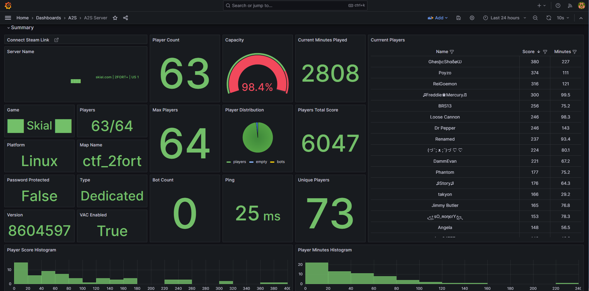

# a2s-gameserver-dashboard

## Overview
This project creates Grafana Dashboards from A2S Query Game Server Data via ClickHouse Backend Database

### Quick Start
 - Start docker compose
```commandline
docker compose up -d
```
 - Execute ```./runmasterquery.sh``` to populate servers once clickhouse is up.
 - Add ```runmasterquery.sh``` to crontab to keep servers updated hourly  ```crontab -e```:
```
0 * * * * /home/user/git/a2s-gameserver-dashboard/runmasterquery.sh
```
 - Open http://localhost:3000
 - Login with admin/admin
 - Open Dashboards Folder A2S

### Dashboard Screenshots
#### A2S Server List

#### A2s Server Summary
